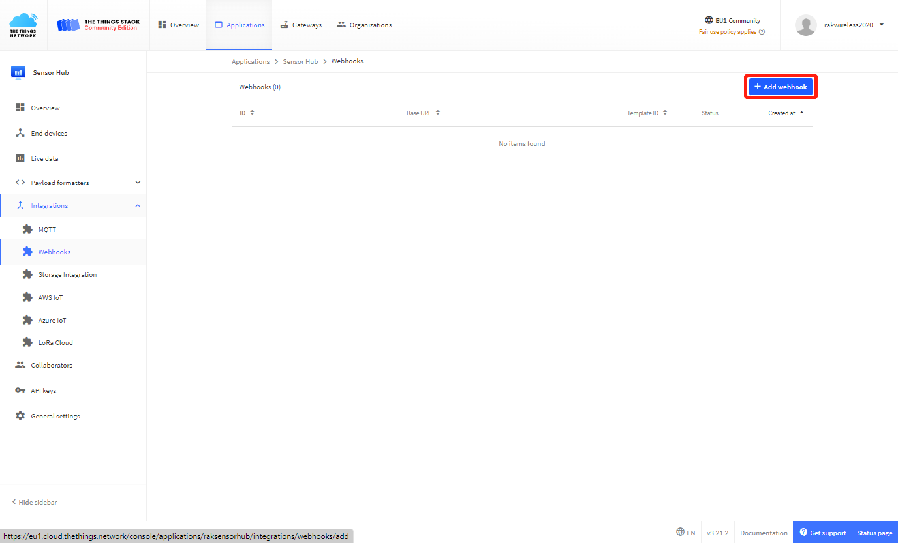
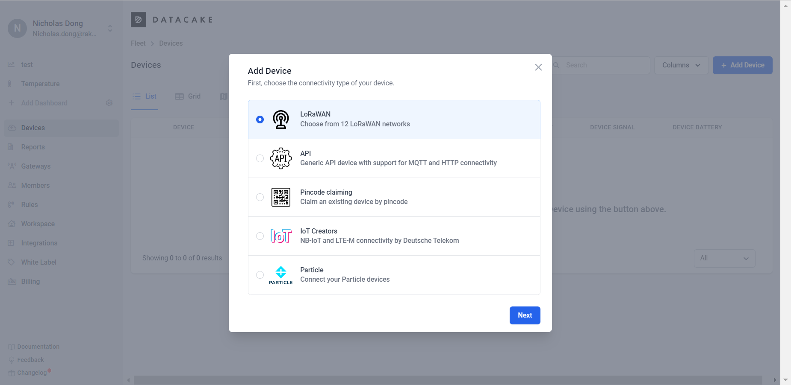
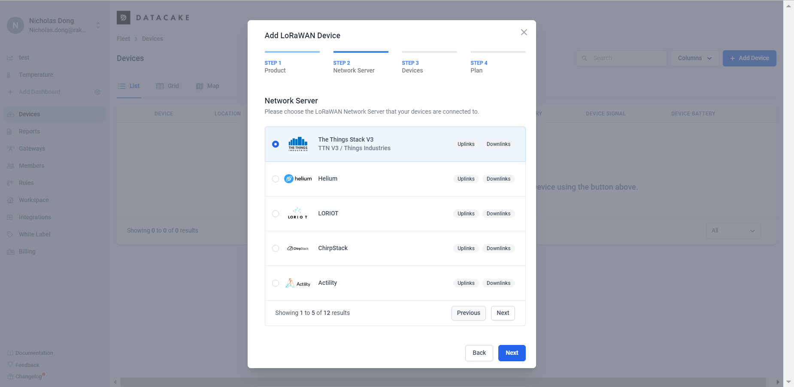
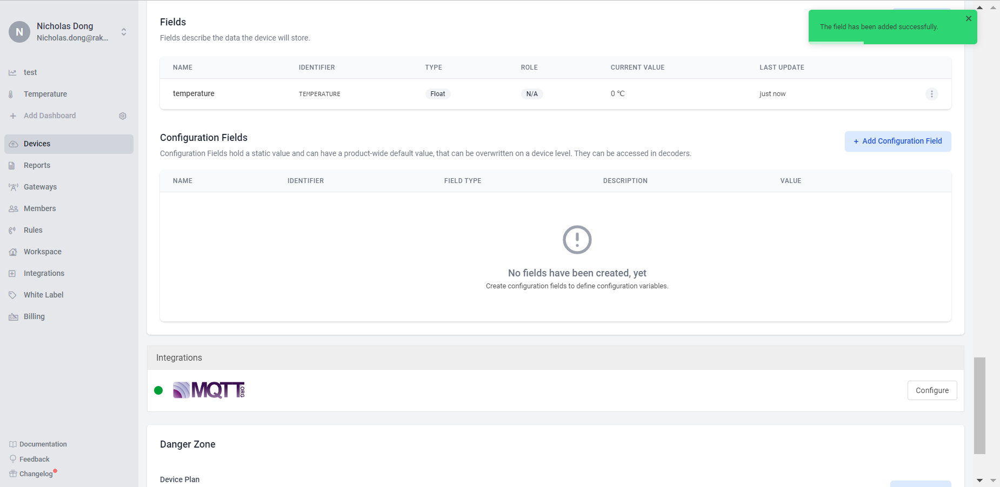
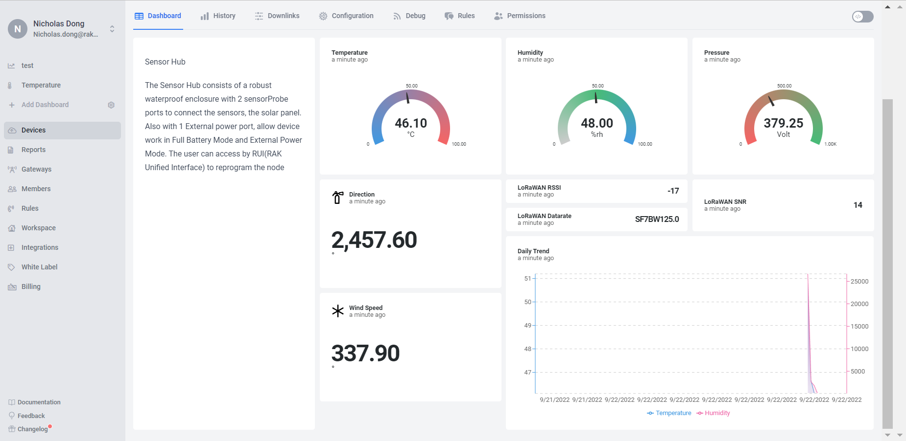

# Integrate Datacake to Create Data Visualizations

#### [#](https://docs.rakwireless.com/Knowledge-Hub/Learn/RAK-Edge-Gateway-Kit-4-TagoIO-Guide/#creating-environment-monitoring-application)Creating Datacake Intergrations

On your TTI Application select Integrations on the Side-Bar,Navigate into the "Webhook" Section of the Integrations on your Application.


Add a new Webhook by clicking the Button "+ Add webhook"



This will show you a list of available webhook-templates you can chose from，Chose the "Datacake" Webhook Template.


Your browser will show you the following page


Now we need to create an API Key on Datacake for Webhook Authentication

Datacake is a multi-purpose IoT platform that visualizes the data from nodes in a more user-friendly way. You can create an account and log in from their [website (opens new window)](https://datacake.co/). After logging in, you will see the following page.


Device page

Navigate over to your Datacake Workspace and select "Members" from Sidebar:

In the members s

After switching to the API Users Tab you click on the upper right Button "Add API User"

This will show you the following dialog:First of all ent

Next select "Devices" from Workspace Permissions List

Click on "Add Permission for all Devices in Workspace"

Here you select "Can record measurements"

Press "Save" to create the Token

The following element will be added to the modal:Next copy the Token from Datacake (click on the "Show" Button to see and copy the Token)

Now switch back to your Application on TTS:


- Enter a webhook id（like “sensorhub”）
- Paste the copied Token into the field "Token"
- Create Datacake Webhook on TTI by clicking on the "Create datacake webhook" Button

That's it. You've now created and set up the Datacake Integration on your TheThingsIndustries Instance. If you have any questions please feel free to ask us. 

# Create your own Device

In many cases it makes sense that you do not create a device on the basis of a template, but start from scratch. In some cases it is also not possible to use a Datacake Template. The reasons for this could be, for example: 

- Your device does not yet have a Datacake Template 
- You develop your own devices (example: via ESP32 or Arduino)
- You need special functionalities that are not covered by the default Template
1. To add your Sensor Hub, click the **+ Add Device** button.
2. Select **LoRaWAN** and click **Next**.



Add device

1. As this is a new device and does not have a ready-to-use template, on the Step 2 tab, click **New Product** and give it a name in the **Product Name** field. Then click **Next**.


Add API device step 2

Please choose the**The Things Stack V3** LoRaWAN Network Server that your devices are connected to.



Add Network Server step 2

On the Step 3 tab, Fill in the device **DEVEUI**. Give a name for your Sensor Hub in the **Name** field. Click **Next** to continue.


Add Device step 3

1. In the last step, choose the payment plan of your device fleet. For this example, we will use the **Free** plan. After the payment plan is selected, click **Add 1 device**.


Payment plan

1. Now you can see your device registered in the **Devices** tab.


Registered device

## Create Payload Decoder

Next step is that you add your custom payload decoder or write it directly on Datacake as the platform provides all the necessary tools for this:

- JavaScript based Payload Decoder
- Functions to test the decoder
- Debug section with logging output

### [#](https://docs.rakwireless.com/Knowledge-Hub/Learn/WisBlock-Kit-4-RAK-Built-in-Network-Server-and-Datacake/#add-decoder-and-fields-for-the-payload)Add Decoder and Fields for the Payload

1. When your devices sends data, the payload will be passed to the payload decoder, alongside the event's name. The payload decoder then transforms it to measurements.


Add decoder

1. Copy the **Decoder function** Code:

```javascript
function Decoder(bytes, port) 
{
  var decoded = {};

  var str=bin2HexStr(bytes);

  while (str.length > 4) {
    var flag = parseInt(str.substring(6, 10), 16);
    switch (flag) {
    case 0x0268:// Wind Direction
        decoded.relative_humidity_2 = parseFloat((parseShort(str.substring(10, 14), 16)* 0.1).toFixed(1));//unit:%RH
        str = str.substring(8);
        break;
     case 0x0167:// Temperature
        decoded.temperature_1 = parseFloat((parseShort(str.substring(10, 14), 16) * 0.1).toFixed(1)) //unit: °C
        str = str.substring(8);
        break;
      default:
        str = str.substring(7);
        break;

    }
  }
   try {
        decoded.lorawan_rssi = (!!normalizedPayload.gateways && !!normalizedPayload.gateways[0] && normalizedPayload.gateways[0].rssi) || 0;
        decoded.lorawan_snr = (!!normalizedPayload.gateways && !!normalizedPayload.gateways[0] && normalizedPayload.gateways[0].snr) || 0;
        decoded.lorawan_datarate = normalizedPayload.data_rate;           
    } catch (e) {
        console.log("Failed to read gateway metadata");
    }
  return decoded;
} 
function bin2HexStr(bytesArr) 
{
  var str = "";
  for(var i=0; i<bytesArr.length; i++) {
    var tmp = (bytesArr[i] & 0xff).toString(16);
    if(tmp.length == 1) {
      tmp = "0" + tmp;
    }
    str += tmp;
  }
  return str;
}

// convert string to short integer
function parseShort(str, base) 
{
  var n = parseInt(str, base);
  return (n << 16) >> 16;
}

// convert string to triple bytes integer
function parseTriple(str, base) 
{
  var n = parseInt(str, base);
  return (n << 8) >> 8;
}
```

Now that you have a decoder, head to the **Fields** section and click **+Add Field**.


 Add field

1. Here, you will set the field settings.


**Figure 31:** Field settings

- As this field is for the temperature, add a suitable name in the **Name** field.

📝 NOTE

The **Identifier** field will automatically be filled based on the name.

- Leave everything else as default and click **Add Field** to add the field.

When an uplink is received, the field will get the **Current value**.



Temperature value

📝 NOTE

This is an example of how to create a Temperature value. You can do the same with the other data.


Complete uplink decoders and fields for Sensor Hub

When an uplink is received, refresh the page and the **Current Value** of the fields will update. Then the only thing left is the dashboard.

### [#](https://docs.rakwireless.com/Knowledge-Hub/Learn/WisBlock-Kit-4-RAK-Built-in-Network-Server-and-Datacake/#create-a-dashboard-to-visualize-the-data)Create a Dashboard to Visualize the Data

The Dashboard can be unique for each user. You can use your imagination to create a dashboard to correspond with your project’s needs.

1. To create a dashboard, head to the Dashboard tab of the device in Datacake and click on the Edit mode switch ()


Edit mode of the Dashboard

1. To add widgets that will help you visualize the data, click **+ Add Widget**.


Datacake widgets

1. You can choose different types of widgets to make your dashboard more useful. For the demonstration, choose **Value**  to visualize a temperature value.
2. In the **Title** field from the **Basic** tab, give a name to the widget. As this is an example with temperature, name it **Temperature**.


Value widget

1. Now, you need to set the value of the temperature field to this widget. Click the **Data** tab and then **Choose temperature Field** and  **add ℃ Unit**.


Set field value to Value widget

1. Select  **Gauge Type ** and **add color** then click **Save**.


Add Gauge Type

1. To add another widget, click again the **+Add Widget** button while the **Edit mode** switch is enabled ().
2. When you are done with adding widgets, don’t forget to switch off the edit mode, to save the edits.
3. You can see an idea of a complete dashboard for the Sensor Hub.



Example dashboard
