# 在一台独立网关上部署LoRaWAN-in-BACnet-out 服务

[English](https://github.com/Sheng2216/lorawan-in-bacnet-out/blob/main/README-en.md)|[中文简体](https://github.com/Sheng2216/lorawan-in-bacnet-out/blob/main/README.md)

## 1. 简介

文本介绍了如何在一台WisGate Connect上部署一个完整的LoRaWAN服务以及一个简单的LoRaWAN-in-BACnet-out示例。节点部分可采用RAKWireless 的Wisblock系列节点，或RAKWireless Senosrhub 节点，或者是第三方LoRaWAN节点。本示例中的LoRaWAN服务是基于UDP packet forwarder和本地The Things Stack网络服务器。所有节点收集到的环境数据（温度、湿度等）将通过LoRaWAN传到WisGate Connect网关中，并在网关内部实现从LoRaWAN转到MQTT，再转换成BACnet IP的整个过程。

### 1.1. Docker compose

示例中的大多数代码和依赖都打包成了容器镜像，可供用户快速部署。我们将在后续开发中持续对环境和依赖进行容器化打包。

关于LoRaWAN的部分，我们提供的[docker compose](./docker-compose.yml)文件中包含以下四个服务：

- `udp-packet-forwarder` interacts with the LoRa chip to receive and transfer LoRa packets
- `stack` is a TTN stack service which depends on `redis` and `postgres` service. This service enables connectivity, management, and monitoring of devices, gateways and end-user applications
- `redis` is the main data store for the Network Server, Application Server and Join Server, and it is also used by Identity Server and event system.
- `postgres` is another databased used by `stack`

### 1.2. 运行服务

WisGate Connect默认运行rakpios，默认用户名是`rak`，密码是`changeme`。

首次登录后，您可以执行以下命令来克隆当前仓库到本地：

```bash
git clone https://github.com/Sheng2216/lorawan-in-bacnet-out.git 
```

接着执行脚本`start.sh`即可。该脚本会自动根据你的当前设备的网络状况来修改一些设置，基础配置完成后将从docker-hub拉取镜像，并部署LoRaWAN相关服务。如果您是第一次运行该示例，请耐心等待镜像pull完成并显示Gateway EUI，Stack URL信息后再继续下一步。

```bash
$ ./start.sh
Server Host is configured to:  10.2.13.254
Configuring docker-compose.yml file
Getting container images and services ready...
[+] Running 9/9
 ⠿ Network lorawan-in-mqtt-out_bridge       Created                              
 ⠿ Volume "lorawan-in-mqtt-out_redis"       Created                              
 ⠿ Volume "lorawan-in-mqtt-out_stack-blob"  Created                              
 ⠿ Volume "lorawan-in-mqtt-out_stack-data"  Created                              
 ⠿ Volume "lorawan-in-mqtt-out_postgres"    Created                              
 ⠿ Container redis                          Started                              
 ⠿ Container postgres                       Started                              
 ⠿ Container udp-packet-forwarder           Started                              
 ⠿ Container stack                          Started                              

---------------------------------------------------------------------
Gateway EUI  : e45f01FFFE51b75d
Stack URL    : https://10.2.13.254/       (admin/changeme)
The next step is to run ./BACnet-out.py
---------------------------------------------------------------------
```

在看到Gateway EUI和Stack URL信息后， 您需要在同一局域网内使用另外一台电脑访问Stack URL，即LoRaWAN网络服务器的web界面。因为网络环境不同，您的TTS Stack URL将会不同于示例中的[https://10.2.13.254/](https://10.2.13.254/)，请注意修改。但是TTS Stack URL的初始用户名和密码将还是  `admin` and `changeme`. 

请注意这里的 **GATEWAY_EUI** 也非常重要，你将在后续的2.1章节-创建Gateway中用到。 

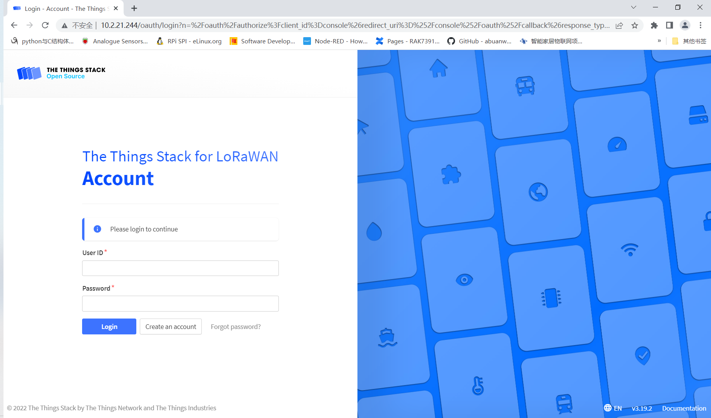

## 2. 准备工作

### 2.1 创建Gateway

在登陆TTS后你需要做的第一步是创建一个网关。点击 “Go to gateways” 就可以创建一个网关。

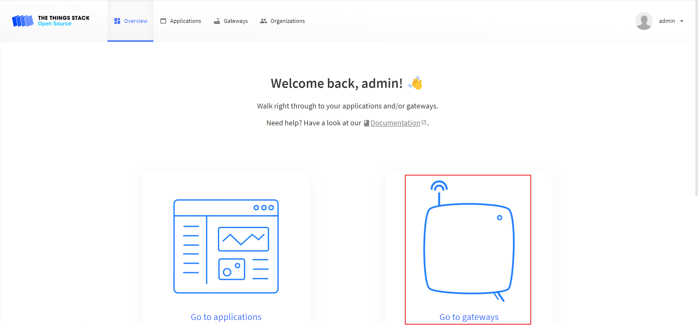

在Gateway EUI中填入我们在1.2章节中获取的EUI即可

如果你忘了保存网关EUI信息，你也可以在WisGate Connect中执行以下命令来直接获取网关的EUI:

```
docker exec -it udp-packet-forwarder ./get_eui.sh
```

该示例中使用的LoRaWAN频段是US915，如果您也使用的是该频段的LoRaWAN集中器和节点，那么只需在TTS的配置页面中选择 `United Status 902-928 MHZ, FSB2(used by TTN)` 即可。如果您使用了其他的频段，请参照TTN官方 [Frequency Plan]([Frequency Plans | The Things Network](https://www.thethingsnetwork.org/docs/lorawan/frequency-plans/) 进行调整（请务必同步手动修改docker-compose.yml）。接着点击保存即可。

在网关创建完成后，请等待数分钟使配置生效。这个过程中您无法立即看到网关的uplink信息，请不要惊慌，这是正常的。这个过程大概需要2-3分钟。在网关成功上线后，你将在右下方看到如下的live data。

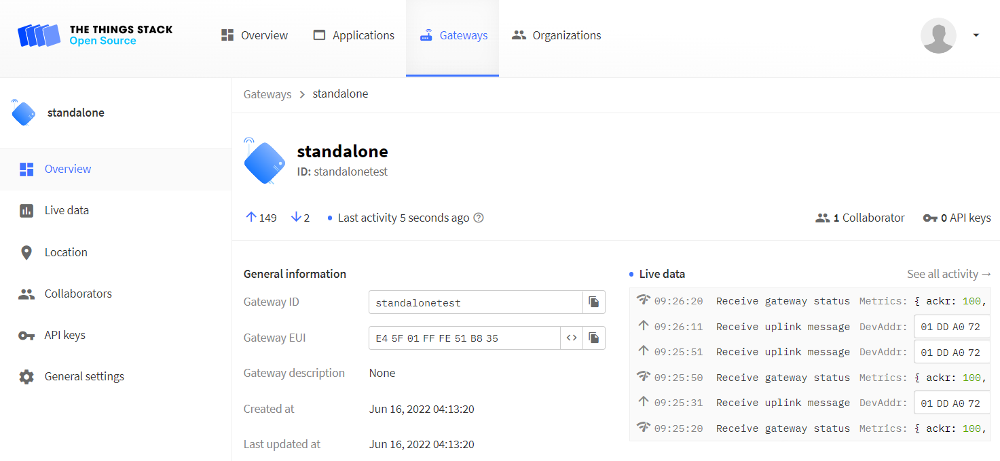

### 2.2 创建Application

此时网关已经上线，现在您需要创建应用（application）来将LoRaWAN节点接入网络。请创建一个名叫**app01**的application（**您可以自定义该application的名称，但需要同步手动修改BACnet-out.py脚本中MQTT broker的名称**）。

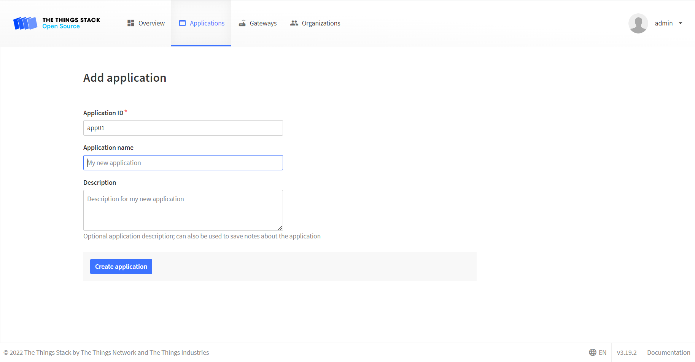

然后您需要生成一个api key,这个key将在后续的BACnet-out.py中被使用到，

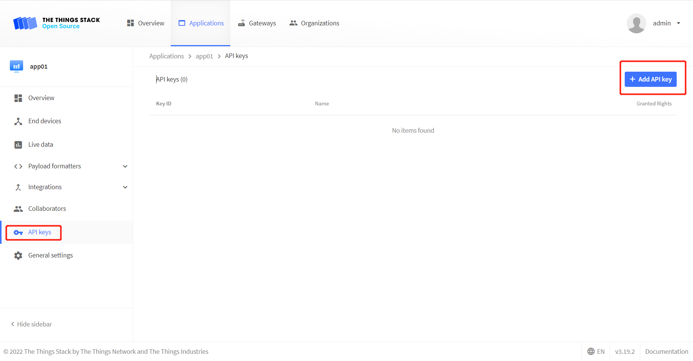

点击API keys，勾选 `Write downlink application traffic` and `Read application traffic (uplink and downlink)` 。这两个权限将被用来订阅MQTT消息。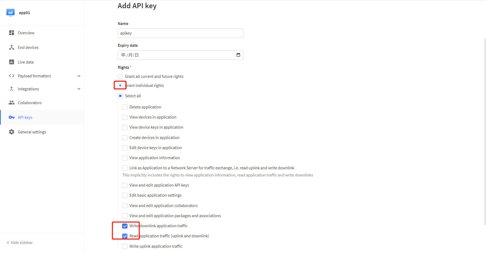

请务必保存好这个API key，因为您只能在当前页面看到，为了保密，之后您将无法在回到该界面查看该API key，除非您重新创建一个全新的API key。

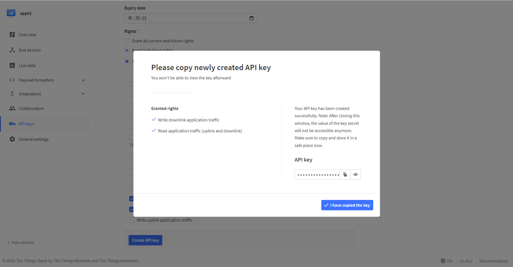

### 2.3 准备节点

接下来我们需要在TTS上注册节点。请在TTS的页面中点击Add device的选项：

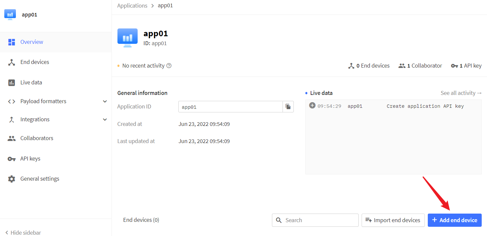

然后手动创建应用，点击`Manually`。如果您使用的是我们随附提供的RAK4631+RAK1901温湿度传感器的组合，那么我们只需要使用我们预先烧录的三元组信息配置。

```
DEVEUI: 70B3D57ED00522DD 
AppEUI: 0000000000000000 
AppKey: 5B48104478F58466EEDEE4E0F91D1D5E 
```

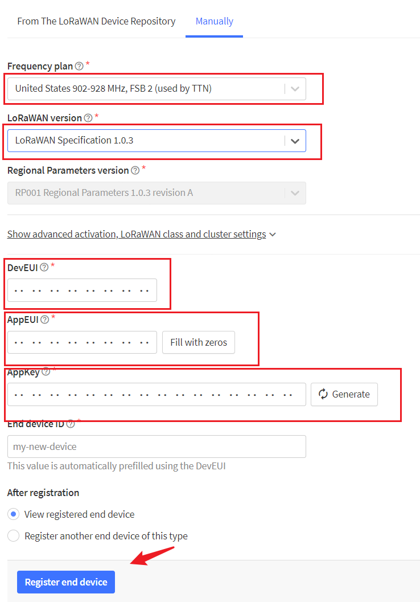

然后点击Register end device即可。在给节点重新上电后，节点会自动发起入网请求，在入网成功后您将在TTS的页面中看到节点已经成功上线。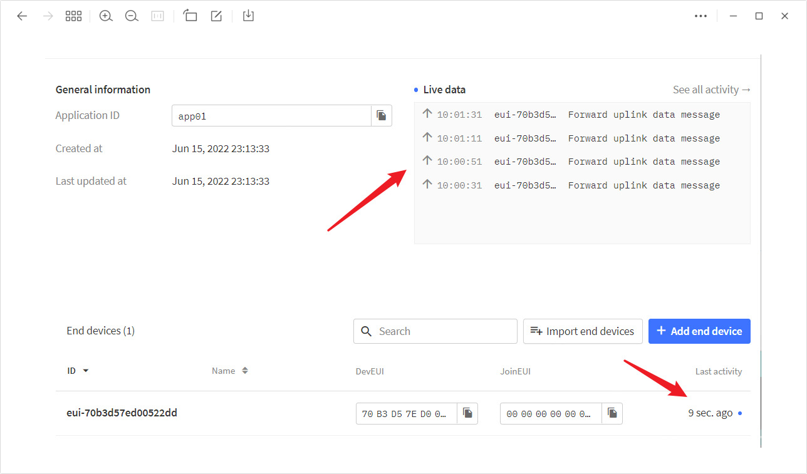

如果您使用的是随附的Wisblock rak4631+RAK1901节点，那么你需要在将该设备配置为使用CayenneLPP  payload formatters, 操作步骤如下：

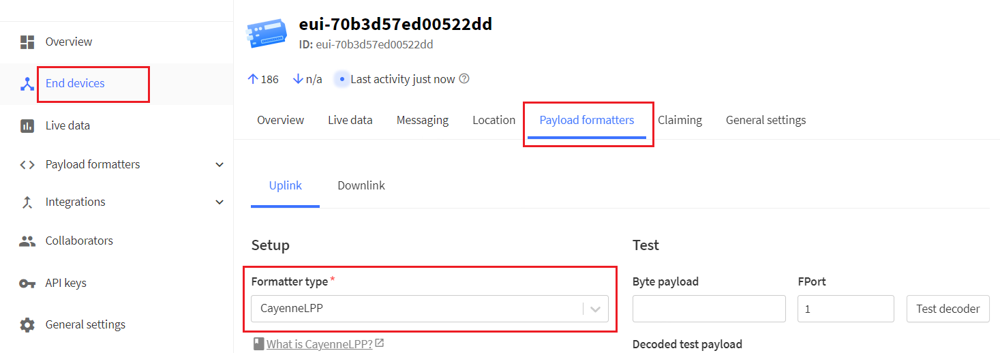

然后您将看到此时节点返回的报文更加易读了，包含了温度和湿度信息：

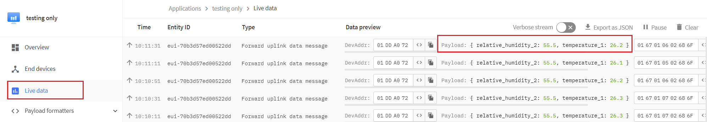

如果您使用的是Sensorhub节点，则需要根据Sensorhub的三元组来进行节点的注册，同时需要使用自定义JavaScript formatter，因为该节点没有使用CayenneLPP protocol来传输数据。

 

您可以将下列示例代码复制粘贴到`Formatter code`栏中：

```javascript
function decodeUplink(input) {
    var decoded = {};
    bytes = bin2HexStr(input.bytes)

    while (bytes.length > 4) {
        var flag = bytes.substring(0, 4);
        switch (flag) {
            case "0000": // sensorhub info
                bytes = bytes.substring(6);
                break;
            case "0167": // Temperature sensor data
                decoded.temperature_1 = parseFloat(parseInt(bytes.substring(4, 8),16)*0.1).toFixed(2) ; //unit: °C
                bytes = bytes.substring(8);
                break;
            case "0268": //Humidity sensor data
                decoded.humidity_2 = parseFloat(parseInt(bytes.substring(4, 8), 16) * 0.1).toFixed(2); //unit: % RH
                bytes = bytes.substring(8);
                break;
            default:
                decoded.unknown = "Unknown data format";
                break;
        }
    }

    return {
        data: {
            relative_humidity_2: decoded.humidity_2,
            temperature_1: decoded.temperature_1,
        },
    };
}

function bin2HexStr(bytesArr) {
    var str = "";
    for (var i = 0; i < bytesArr.length; i++) {
        var tmp = (bytesArr[i] & 0xff).toString(16);
        if (tmp.length == 1) {
            tmp = "0" + tmp;
        }
        str += tmp;
    }
    return str;
}
```

## 3. 创建 BACnet 应用

这一部分是最简单的，您只需要在WisGate Connect的终端中找到`start.sh`的同级目录，然后在该目录下执行如下命令将我们在步骤2.2中获得的API key 写入到配置文件中：

```bash
echo "<MQTT-key-generated-in-section-2.2>" > mqtt_config
```

然后通过以下命令安装python依赖库：

```bash
pip3 install paho-mqtt bacpypes
```

启动**BACnet-out.py** 脚本，运行结果应该是这样

```bash
rak@rakpios:lorawan-in-bacnet-out $ ./BACnet-out.py 
Connected to MQTT Broker!
A sample BACnet application is created...
It will read temperature inputs from LoRaWAN nodes via MQTT, and then send it out via BACnet IP...
25.5
25.4
26.2
```

如果您有使用[YABE](https://sourceforge.net/projects/yetanotherbacnetexplorer/)这类BACnet设备浏览器，您将可以看到一个名叫WisGate Connect的设备已经上线，该设备可以通过BACnet IP传输LoRaWAN节点读取到的温度信息。

## 4. 数据可视化

如果您需要一个数据可视化界面来实时展示传感器数据，请参照这篇[文档](https://github.com/Sheng2216/lorawan-in-bacnet-out/blob/main/Data-Visualizations-via-Datcake.md)。遵循这篇文档，您将可以轻松地使用网关内置TTS提供的Webhook来集成Datacake。您将可以在电脑端、移动端等多个平台观察到最新的环境检测数据和图表，如下所示：

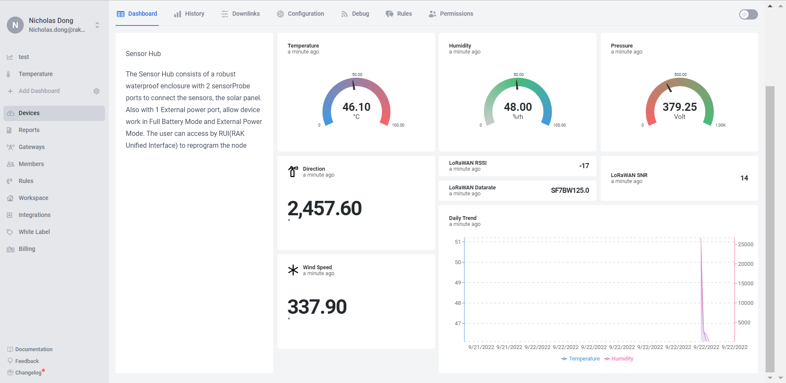

## 5. License

This project is licensed under MIT license.
